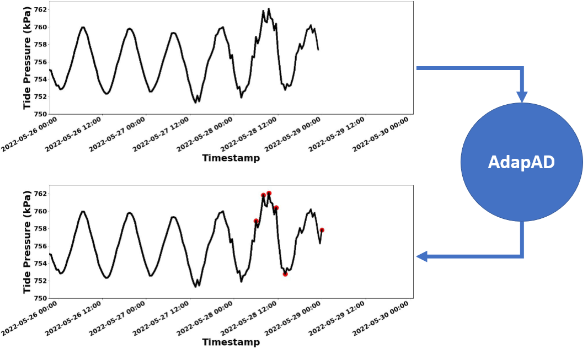
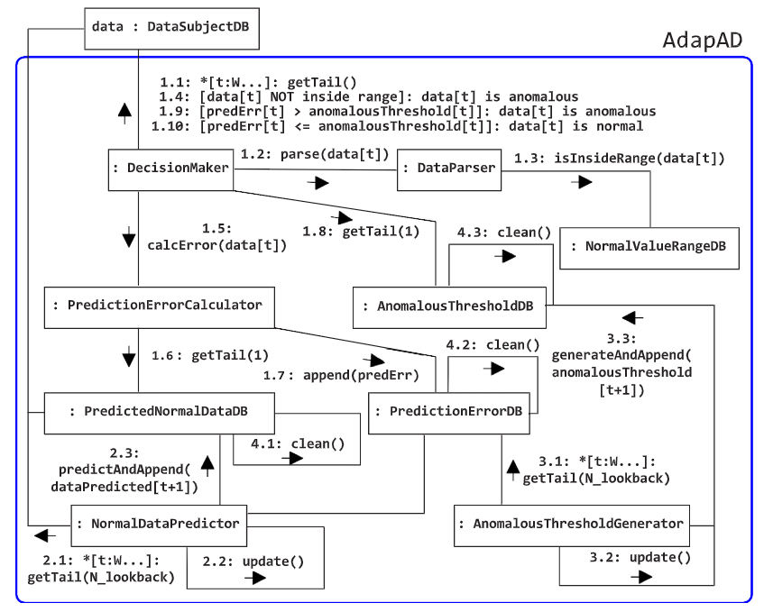

<p align="center">

</p>

<h1 align="center">
<h2 align="center">Concept-drift-adaptive anomaly detector for marine sensor data streams</h2>

AdapAD is a semi-supervised anomaly detector designed to detect anomalies in univariate marine data streams. The operation flow of AdapAD is illustrated below.

<div align="center">
  
</div>

If you use AdapAD in your project or research, please cite the following paper:

- [Internet of Things, Elsevier, 2024](https://www.sciencedirect.com/science/article/pii/S254266052400355X)

### Reference

> Nguyen, N.T., Heldal, R. and Pelliccione, P., 2024. Concept-drift-adaptive anomaly detector for marine sensor data streams. Internet of Things, p.101414.

```bibtex
@article{nguyen2024concept,
  title={Concept-drift-adaptive anomaly detector for marine sensor data streams},
  author={Nguyen, Ngoc-Thanh and Heldal, Rogardt and Pelliccione, Patrizio},
  journal={Internet of Things},
  pages={101414},
  year={2024},
  publisher={Elsevier}
}
```

## Installation

To install and use AdapAD from source, you will need the following tools:

- `git`
- `conda` (anaconda or miniconda)

#### Steps for installation

**Step 1:** Clone this repository using `git` and change into its root directory.

```bash
git clone https://github.com/ntnguyen-so/AdapAD_alg
cd AdapAD_alg
```

**Step 2:** Install necessary modules for `AdapAD_alg`.

```bash
pip install -r requirements.txt
```

**Step 3:** Installation complete!

## Usage

Execute the following command to run the algorithm
```bash
python3 main.py
```

You can find all the hyperparameters setting in `config.py`

## Structure

Below you can find the structure of the repository.

- 01_data: data used in the study
  - 01_label: data with anomalies that we identified together with domain experts. 
  - 02_labelling_process: explanations of anomaly labelling process for the three datasets used in the study.
- 02_benchmark: results of the benchmark stage discussed in Section 3. See README.txt to replicate our experiments in the benchmark stage.
- 03_validation: results that we showed in Section 5. Validation.
- 04_misc: 
  - 01_development_progress: experimental results of AdapAD v0.2 on the benchmark data.
  - 02_compare_training_size: experimental results when we attempted to increase training size of semi-supervised algorithms during the benchmark study stage (see Section 2.1 in the paper).
 

